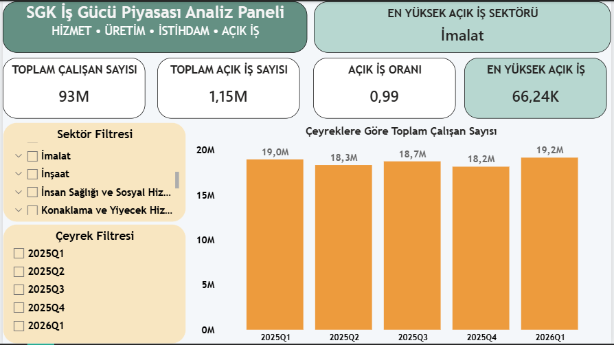

# SGK Labor Market Analysis
This project analyzes SGK labor market data using Excel, Power Query, SQL Server and Power BI.
The project includes an end-to-end data analysis workflow covering data preparation, Excel dashboard creation, SQL database modeling, SQL analysis queries and Power BI reporting.
---
## Tools Used
- Excel
- Power Query
- Pivot Tables
- SQL Server
- SQL Server Management Studio
- Power BI
- DAX Measures
- Git & GitHub
---
## Project Structure
```text
sgk-labor-market-analysis
│
├── data
│   └── Quarterly SGK reports
│
├── excel
│   ├── images
│   ├── video
│   └── sgk_labor_market_excel_dashboard.xlsx
│
├── sql
│   ├── relationship_table
│   ├── 01_create_tables.sql
│   └── 02_analysis_queries.sql
│
├── powerbi
│   ├── image
│   │   └── powerbi-dashboard.png
│   └── SGK_Labor_Market_Analysis_Dashboard.pbix
│
└── README.md
```
---
## Excel Dashboard
The Excel dashboard was created using Power Query and Pivot Tables.
It includes:
- Employee count analysis
- Open job count analysis
- Open job rate analysis
- Sector-based comparison
- Quarterly labor market indicators
- Interactive filtering structure
The Excel part was used as the first dashboard and data preparation stage of the project.
---
## SQL Analysis
The SQL part includes database modeling and analysis queries.
Main tables:
- PERIODS
- SECTORS
- QUARTERLY_CORE_METRICS
- EMPLOYMENT_EXPECTATIONS
- PRODUCTION_EXPECTATIONS
- OCCUPATION_SKILL_ANALYSIS
---
## SQL Analysis Topics
The SQL queries cover:
- Sector count by period
- Duplicate record check
- Total record count by table
- Top sectors by open job count
- Top sectors by open job rate
- Employee count change by period
- Open job count change by period
- Employment expectation analysis
- Production/service expectation analysis
- Employment vs production expectation comparison
- Occupation skill analysis
---
## Key SQL Concepts Used
- JOIN
- GROUP BY
- HAVING
- COUNT
- COUNT DISTINCT
- SUM
- AVG
- ABS
- ORDER BY
- TOP
- Primary Key / Foreign Key relationships
---
## Power BI Dashboard
The Power BI dashboard was created by connecting the SQL Server database to Power BI.
This stage converts the modeled SQL data into an interactive reporting dashboard.
The dashboard includes:
- Total employee count
- Total open job count
- Open job rate
- Highest open job sector
- Highest open job count
- Employee count by quarter
- Sector filter
- Quarter filter
---
## Power BI Features Used
- SQL Server data connection
- Data model relationships
- DAX measures
- KPI cards
- Slicer filters
- Column chart
- Dynamic sector-based calculation
---
## Dashboard Preview

---
## Project Status
Completed:
- Excel dashboard
- SQL database schema
- SQL relationship model
- SQL analysis queries
- Power BI dashboard
---
## Goal
The goal of this project is to demonstrate an end-to-end data analysis workflow:
```text
Raw Reports → Excel / Power Query → SQL Server → SQL Analysis → Power BI Dashboard
```
This project was created as a portfolio project for junior data analyst and reporting roles.
---
## Author
Emre Erol
