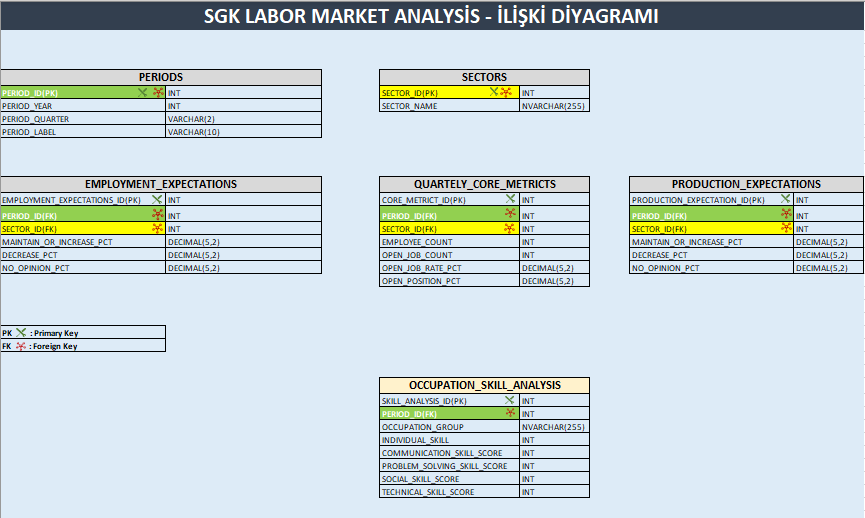

# SGK Labor Market Analysis
This project analyzes SGK labor market data using Excel, Power Query and SQL Server.
The project includes an Excel dashboard and SQL analysis queries focused on employment, open jobs, sector trends, employment expectations, production/service expectations and occupation skill indicators.
---
## Tools Used
- Excel
- Power Query
- Pivot Tables
- SQL Server
- SQL Server Management Studio
- Git & GitHub
---
## Project Structure
```text
sgk-labor-market-analysis
│
├── data
│   └── Quarterly SGK reports
│
├── excel
│   ├── images
│   ├── video
│   └── sgk_labor_market_excel_dashboard.xlsx
│
├── sql
│   ├── relationship_table
│   ├── 01_create_tables.sql
│   └── 02_analysis_queries.sql
│
└── README.md
```
---
## Excel Dashboard
The Excel dashboard was created using Power Query and Pivot Tables.
It includes:
- Employee count analysis
- Open job count analysis
- Open job rate analysis
- Sector-based comparison
- Quarterly labor market indicators

---
## SQL Analysis
The SQL part includes database modeling and analysis queries.
Main tables:
- `PERIODS`
- `SECTORS`
- `QUARTERLY_CORE_METRICS`
- `EMPLOYMENT_EXPECTATIONS`
- `PRODUCTION_EXPECTATIONS`
- `OCCUPATION_SKILL_ANALYSIS`

---
## SQL Analysis Topics
The SQL queries cover:
- Sector count by period
- Duplicate record check
- Total record count by table
- Top sectors by open job count
- Top sectors by open job rate
- Employee count change by period
- Open job count change by period
- Employment expectation analysis
- Production/service expectation analysis
- Employment vs production expectation comparison
- Occupation skill analysis
---
## Key SQL Concepts Used

- `JOIN`
- `GROUP BY`
- `HAVING`
- `COUNT`
- `COUNT DISTINCT`
- `SUM`
- `AVG`
- `ABS`
- `ORDER BY`
- `TOP`
- Primary Key / Foreign Key relationships
---
## Project Status
Completed:
- Excel dashboard
- SQL database schema
- SQL relationship model
- SQL analysis queries
In progress:
- Power BI report
---
## Goal
The goal of this project is to demonstrate an end-to-end data analysis workflow:
```text
Raw Reports → Excel / Power Query → SQL Server → SQL Analysis → Dashboard
```
This project was created as a portfolio project for junior data analyst and reporting roles.
---
## Author
**Emre Erol**
